# Results 

## 9/8/2017

- Running new code in onelayer
  - Leave out derivative cost
  - Add different weighted versions of original 'classification' cost
  - Make the 'difference' cost be wrt un-quantized version
  - Conclusion: for fewer bits, helps to have higher weight on classification cost

### 8 Bits (64 hidden)

- Weight 0.5 on classification cost
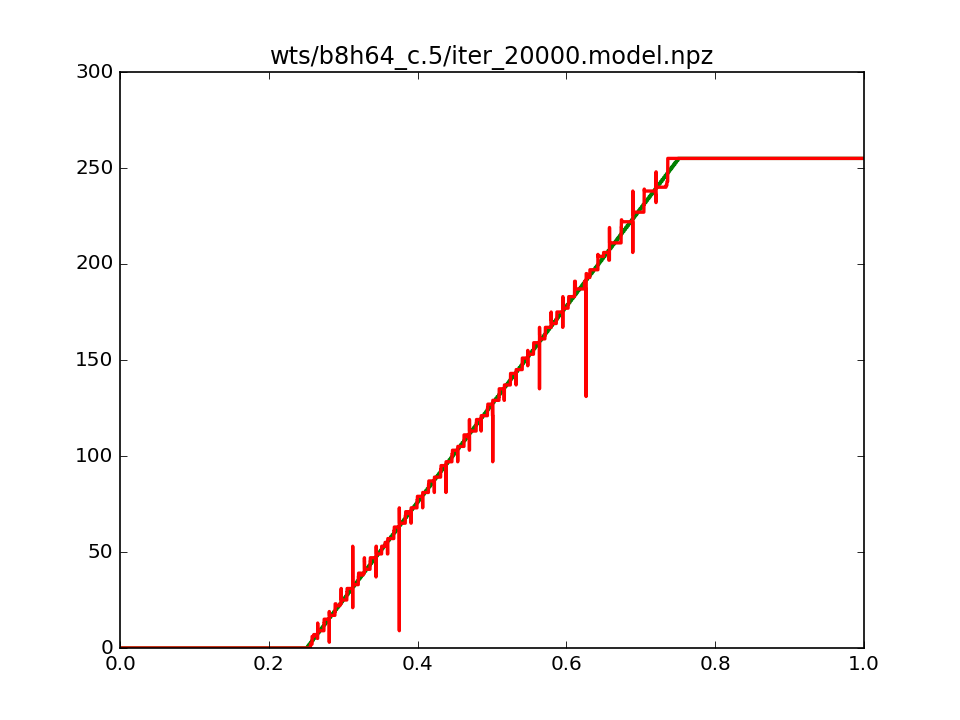
- Weight 1 on classification cost
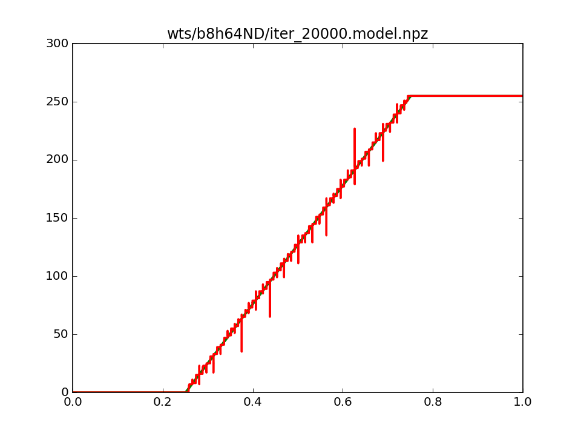
- Weight 2 on classification cost
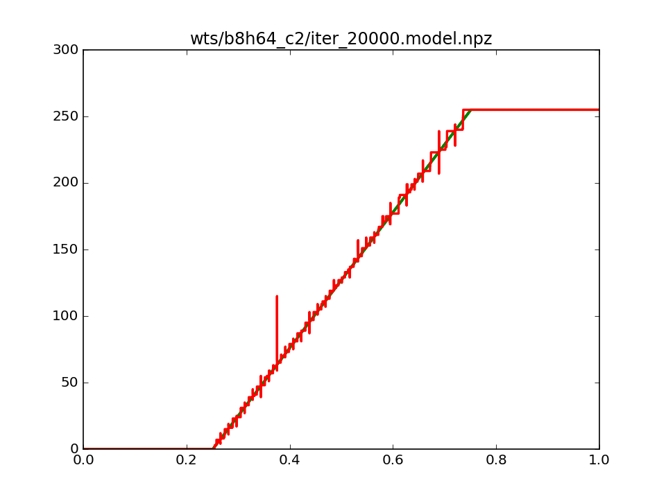
- Weight 4 on classification cost
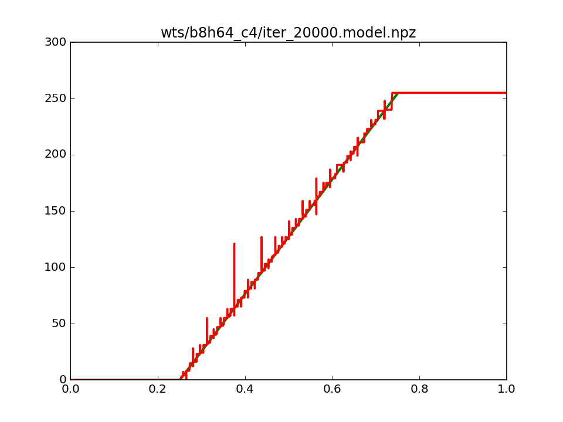

### 6 Bits (36 hidden)

- Weight 0.5 on classification cost
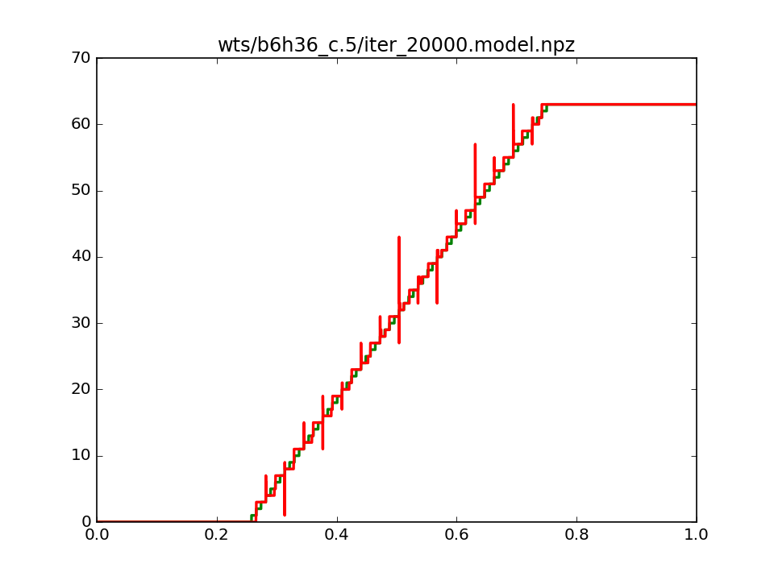
- Weight 1 on classification cost
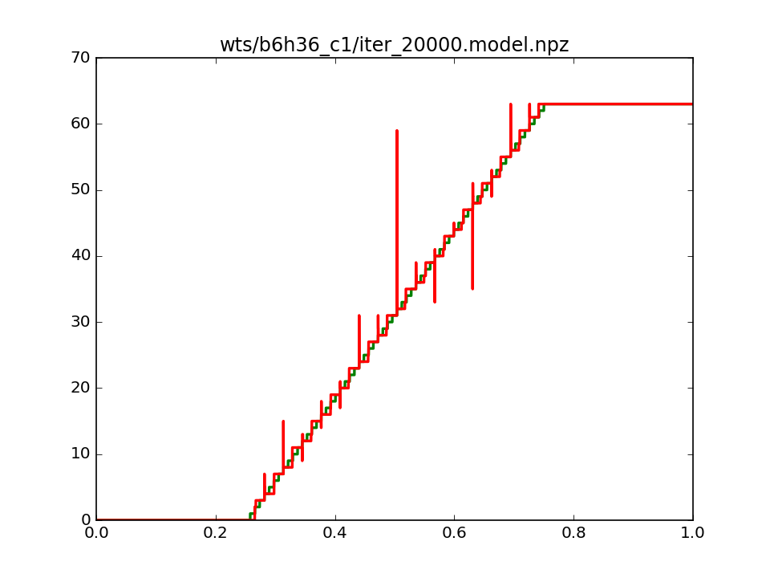
- Weight 2 on classification cost
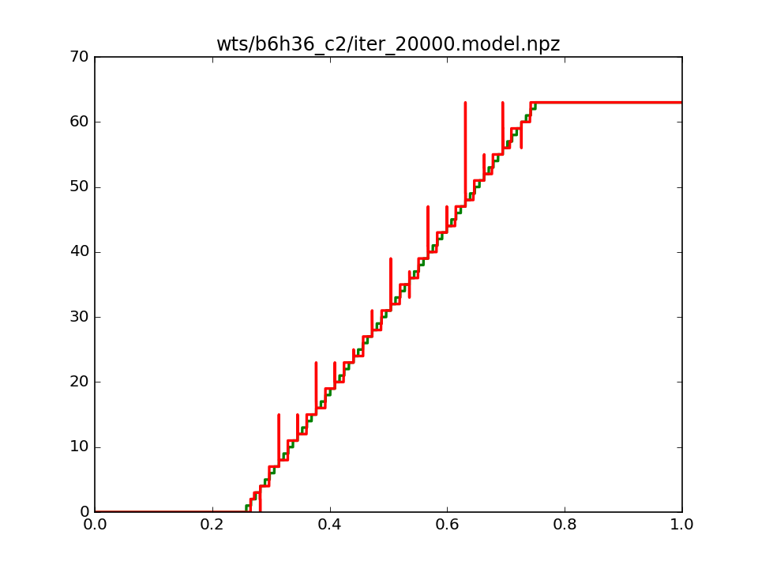
- Weight 4 on classification cost
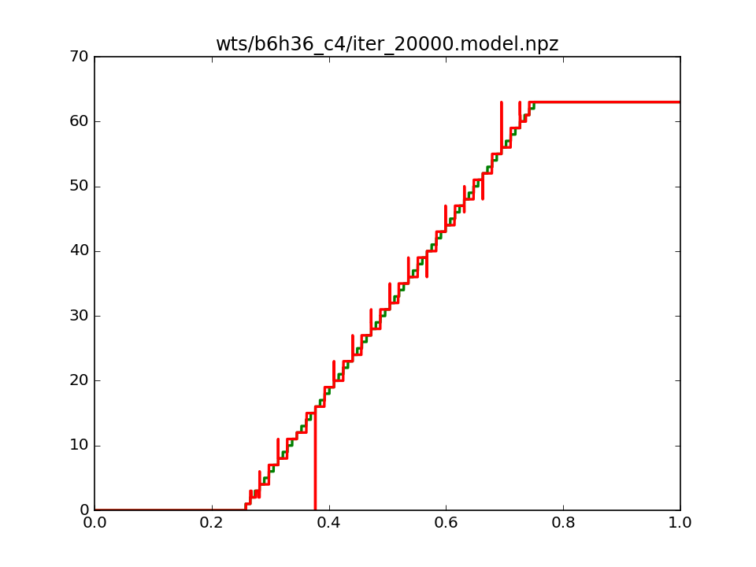

### 4 Bits (16 hidden)

- Weight 0.5 on classification cost
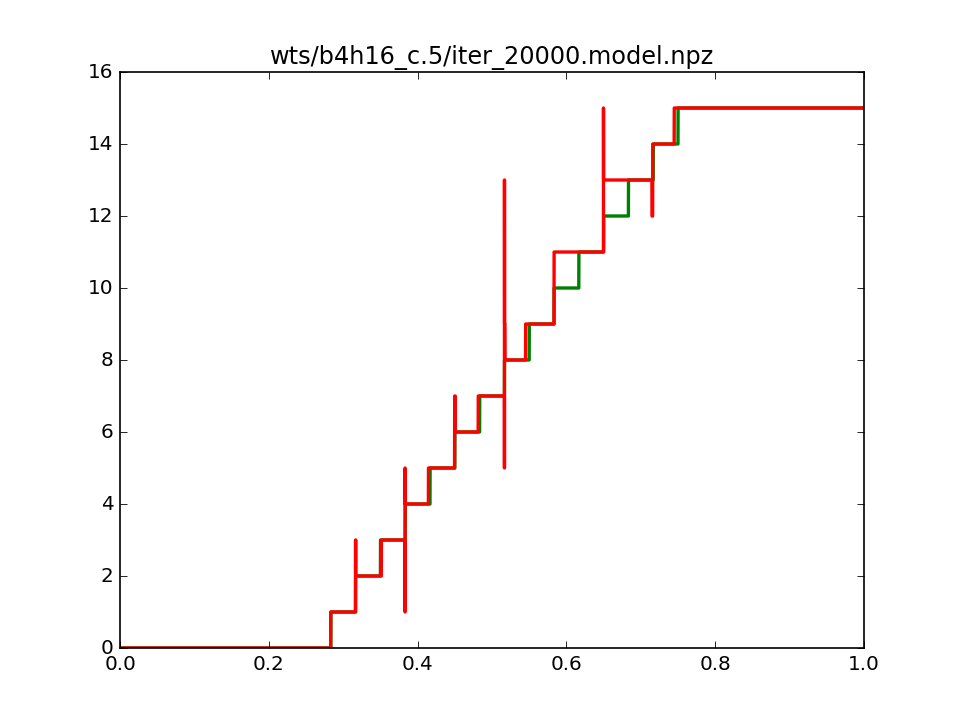
- Weight 1 on classification cost
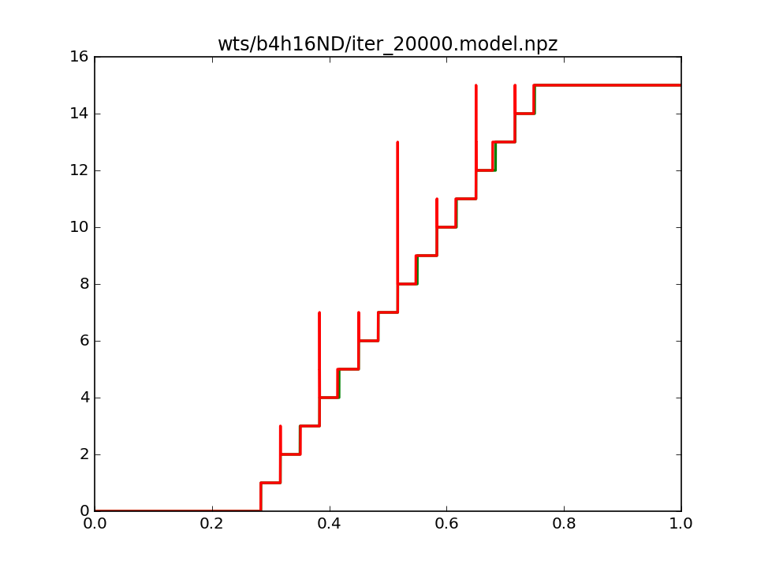
- Weight 2 on classification cost
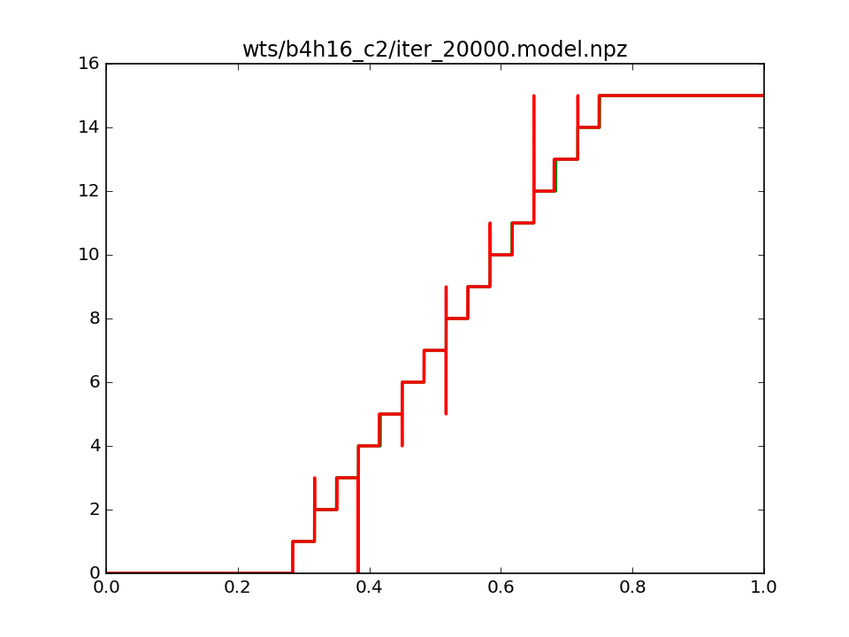
- Weight 4 on classification cost
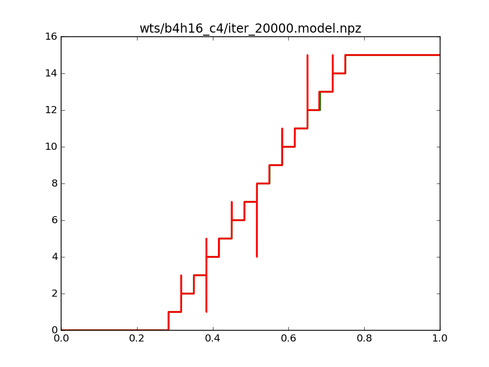

## 9/4/2017

- Running code in onelayer
  - Two versions, one with and one without adding a derivative cost.
  - Train for 20k iterations. 10k with lr = 1e-2, 5k with 1e-2.5 and 5k with 1e-3
  - Add weight decay to all weights (seems to help stabilize).
  
- 8 Bit, 64 Hidden, Derivative Loss

- 8 Bit, 64 Hidden, No Derivative Loss

- 8 Bit, 32 Hidden, Derivative Loss

- 8 Bit, 32 Hidden, No Derivative Loss

- 6 Bit, 36 Hidden, Derivative Loss

- 6 Bit, 36 Hidden, No Derivative Loss

- 4 Bit, 16 Hidden, Derivative Loss

- 4 Bit, 16 Hidden, No Derivative Loss

