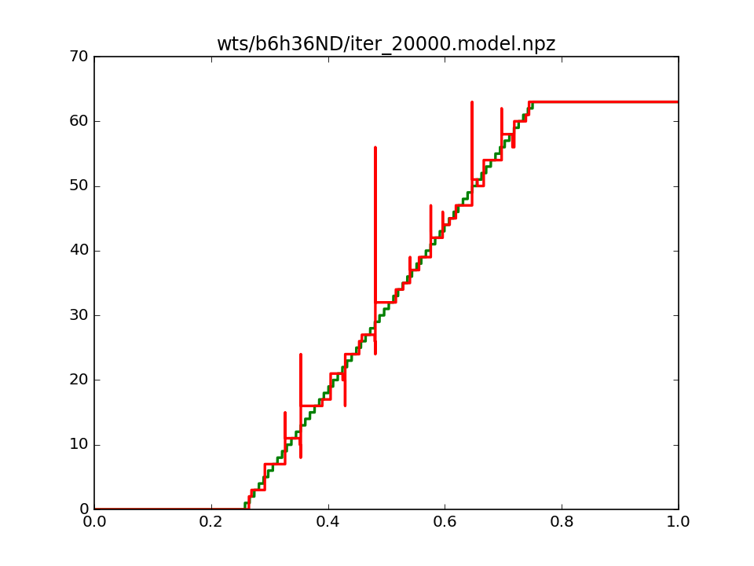

# Results 

## 9/4/2017

- Running code in onelayer
  - Two versions, one with and one without adding a derivative cost.
  - Train for 20k iterations. 10k with lr = 1e-2, 5k with 1e-2.5 and 5k with 1e-3
  - Add weight decay to all weights (seems to help stabilize).
  
- 8 Bit, 64 Hidden, Derivative Loss

- 8 Bit, 64 Hidden, No Derivative Loss

- 8 Bit, 32 Hidden, Derivative Loss

- 8 Bit, 32 Hidden, No Derivative Loss

- 6 Bit, 36 Hidden, Derivative Loss

- 6 Bit, 36 Hidden, No Derivative Loss

- 4 Bit, 16 Hidden, Derivative Loss

- 4 Bit, 16 Hidden, No Derivative Loss

